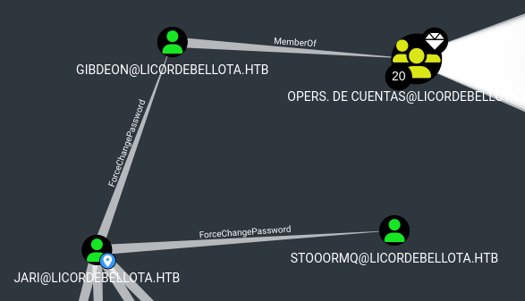

# Routing Protocols

Routing Protocols are used for packets to find their way around a network, and to also take the most efficient path there based on something called **cost** or **metric,** depending on the protocol used. These protocols send information about the path finding, which is stored in the **routing tables of routers.** This is a small database to let the router remember which route to take for certain destinations.&#x20;

There are loads of protocols, and the ones covered in the CCNA are RIP, RIPv2, IGRP, EIGRP, IS-IS and BGP. We only need to know how to configure RIP, RIPv2, EIGRP and OSPF. I won't be going in-depth for IS-IS and BGP.

There are 2 types of routing protocols, namely **distance vector** (RIP, IGRP) **** and **link state (**OSPF, IS-IS). EIGRP is considered an advanced distance vector protocol, and is a Cisco Proprietary protocol, meaning that only Cisco devices can use this.&#x20;

The routing protocols mentioned above are all interior routing protocols, meaning they are used to exchange information and send packets within one system, such as a LAN. External routing protocols are used to exchange information between multiple systems, and are used to route information across the Internet.

Configuration of these protocols is not covered here, but rather just the concepts of routing.

## Distance Vector&#x20;

Routers that use this protocol do not possess topological information about the network, but rather rely on the neighbours information. Everytime a new connection is made to a new router on one side, the new router would start to send information about the network on the other side. Specifically, they would send their routing table to other routers on the network.&#x20;

The name is derived from how the routes are advertised as vectors of distance, where distance is defined in terms of **metric** or cost. They would use a **hop count** to determine which path is the optimal one to take.&#x20;

Distance Vector protocols are generally used on smaller networks where there are few routers. However, it has issues with scalability as it struggles to provide the services required.&#x20;

### RIP / RIPv2

RIP is one of the oldest routing protocols. It is easy to configure and maintain, but lacks a lot of advanced features that the newer protocols have. The main thing that RIP uses hop count as a metric. Hop count is basically the number of devices that the traffic passes by when it travels to its host.&#x20;

<figure><figcaption></figcaption></figure>

Take note that for RIP, the defualt maximum hop count is 15, and any route with a higher hop count is considered unreachable.&#x20;

The difference between RIP and RIPv2 is that RIPv2 is capable of advertising subnet masks and uses multicast to send routing updates, while version 1 doesn't advertise subnet masks and uses **broadcast** for updates. Version 2 is backwards compatible with version 1. RIPv2 also sends the entire routing table every 30 seconds to other routers to ensure they are up to date. This can take up a lot of bandwidth on the network, which is why RIP isn't too popular.&#x20;

We can analyse how RIP works using this topology:

<figure><figcaption></figcaption></figure>

R1 connects directly to another subnet, and RIP has been configured. R1 would send routing updates to R2 and R3, and the routing updates list the subnet, subnet mask and hop count (metric) for this route. Each router would receive this update and add to their routing tables. In this case, both routers would have a metric of 1 because they are one hop away.

So RIP calculates the path with the least hop count from point A to point B, and then just uses that path for packets to travel. There are some limitations to this, however. One is the failure to consider the bandwidth of a specific route. For example, a route with a hop count of 5 with an average bandwidth of 100Mbps is a lot faster than another route with a hop count of 4 with an average bandwidth of 10Mbps. RIP would choose the route with a hop count of 4!

### IGRP

IGRP is an advanced distance vector protocol. There are a few features that distinguish it from RIP, namely the improved scalability and improved routing.

Earlier I mentioned that RIP has a max hop count of 15. In IGRP, this maximum is 100 by default. The metric that IGRP uses is also not solely based on hop count, and internetwork delay and bandwidth are used to arrive at a composite metric. Reliability, load and MTU can also be included.

IGRP can maintain up to 6 unequal cost paths between one source and one destination, but only the route with the lowest metric is in the routing table. RIP on the other hand, keeps one and disregards the rest.&#x20;

IGRP is sort of like advanced RIP that takes more into consideration when determining the route for traffic to take in larger networks.&#x20;

## Link State Protocols

These protocols serve the same purpose as distance vector protocols, but they do it in a different manner. Earlier, I mentioned that Distance Vector Protocols make routers send their routing table around. Link state protocols to not do so, but instead they would 'advertise' their information about a network topology, such as directly connected hosts or routers. This would ensure that the routers in this system all have the same topology database.&#x20;

These protocols converge a lot faster (meaning all routers are on same page faster) and send updates using multicast addresses. They also require more CPU and RAM usage and can be significantly harder to configure.

In general, they rely on 3 tables:

* Neighbour Table
  * Table of other routers that are running the same routing protocol.&#x20;
* Topology Table
  * Stores information about the topology of the entire network using routing by rumour
* Routing Table
  * Stores the best routes for each path

### OSPF

OSPF is a non-proprietary routing protocols (which means any brand router can run it). How OSPF functions is through the use of&#x20;
